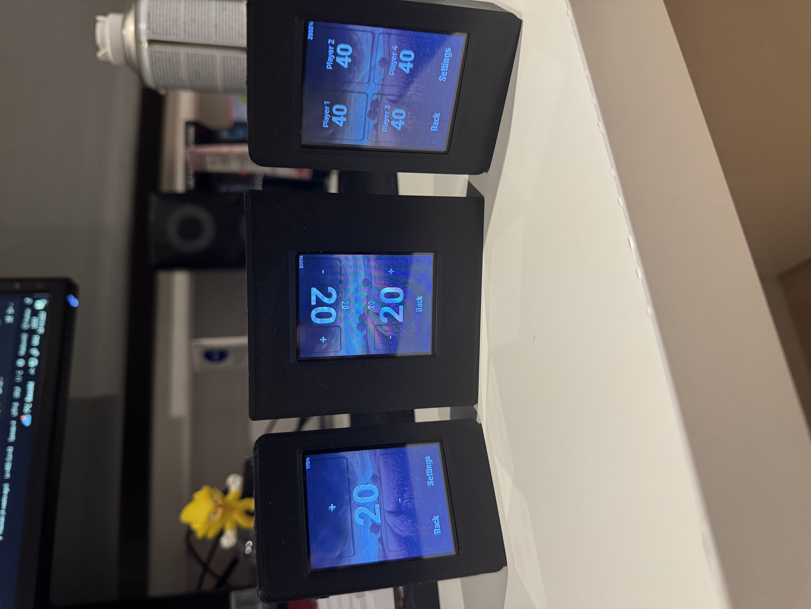

# MaoTek eDeckBox — electronic DeckBox for MTG with built-in lifecounter



## Parts

- Cheap Yellow Display 2.4 inch capacitive touch
- 1800mAh LiPo 803450 (preferably with JST 1.25mm)
- 100K & 33K resistor for voltage divider
- New IP5306 powermangement IC (double click shutoff), since some default boards have IP5306 with 10 seconds press for shutdown - impractical

---

## Stack

- LVGL v8.3.11
- PlatformIO
- Arduino
- EEZstudio
  
---

## First-time setup (EEZ + config_files)

### 1) Open the EEZ project

- Launch EEZstudio and open `eez/MTGDeckBox.eez-project`.

### 2) Install `config_files/`

This repository includes `config_files/` with:

- `lv_conf.h` (LVGL configuration)
- `User_Setup.h` (TFT_eSPI configuration)

**Option B — copy into libraries (manual)**

- Copy `config_files/lv_conf.h` into your LVGL library folder.
- Copy `config_files/User_Setup.h` into your TFT_eSPI library folder.

### 3) Build / Upload / Monitor (PowerShell)

```powershell
# build
pio run

# upload
pio run -t upload

# serial monitor
pio device monitor -b 115200
```

## TODO

- Battery Percentage Readout (Voltage divider is noisy)
- Minor Bugs
- Rotation for EDH life tracker
- Upload .STL files for 3D printed case
  
---

## Note: For performance monitor, please paste the following code into LVGL `lvgl/src/core/lv_refr.c`

Put this variable at the top of the file:

```cpp
#if LV_USE_PERF_MONITOR
static bool perf_monitor_enabled = false;
#endif
```

Then define this somewhere:

```cpp
#if LV_USE_PERF_MONITOR && LV_USE_LABEL
lv_obj_t *lv_perf_monitor_get_label(void)
{
    return perf_monitor.perf_label;
}
#endif

#if LV_USE_PERF_MONITOR
void lv_perf_monitor_enable(bool en)
{
    perf_monitor_enabled = en;
}
#endif
```

And wrap the following code with the boolean:

```cpp
    if (perf_monitor_enabled)
    {

        if (lv_tick_elaps(perf_monitor.perf_last_time) < 300)
        {
            if (px_num > 5000)
            {
                perf_monitor.elaps_sum += elaps;
                perf_monitor.frame_cnt++;
            }
        }
        else
        {
            perf_monitor.perf_last_time = lv_tick_get();
            uint32_t fps_limit;
            uint32_t fps;

            if (disp_refr->refr_timer)
            {
                fps_limit = 1000 / disp_refr->refr_timer->period;
            }
            else
            {
                fps_limit = 1000 / LV_DISP_DEF_REFR_PERIOD;
            }

            if (perf_monitor.elaps_sum == 0)
            {
                perf_monitor.elaps_sum = 1;
            }
            if (perf_monitor.frame_cnt == 0)
            {
                fps = fps_limit;
            }
            else
            {
                fps = (1000 * perf_monitor.frame_cnt) / perf_monitor.elaps_sum;
            }
            perf_monitor.elaps_sum = 0;
            perf_monitor.frame_cnt = 0;
            if (fps > fps_limit)
            {
                fps = fps_limit;
            }

            perf_monitor.fps_sum_all += fps;
            perf_monitor.fps_sum_cnt++;
            uint32_t cpu = 100 - lv_timer_get_idle();
            lv_label_set_text_fmt(perf_label, "%" LV_PRIu32 " FPS\n%" LV_PRIu32 "%% CPU", fps, cpu);
        }
    }
```

Finally, add the hidden flag:

```cpp
#if LV_USE_PERF_MONITOR && LV_USE_LABEL
    lv_obj_t *perf_label = perf_monitor.perf_label;
    if (perf_label == NULL)
    {
        perf_label = lv_label_create(lv_layer_sys());
        lv_obj_set_style_bg_opa(perf_label, LV_OPA_50, 0);
        lv_obj_set_style_bg_color(perf_label, lv_color_black(), 0);
        lv_obj_set_style_text_color(perf_label, lv_color_white(), 0);
        lv_obj_set_style_pad_top(perf_label, 3, 0);
        lv_obj_set_style_pad_bottom(perf_label, 3, 0);
        lv_obj_set_style_pad_left(perf_label, 3, 0);
        lv_obj_set_style_pad_right(perf_label, 3, 0);
        lv_obj_set_style_text_align(perf_label, LV_TEXT_ALIGN_RIGHT, 0);
        lv_label_set_text(perf_label, "?");
        lv_obj_align(perf_label, LV_USE_PERF_MONITOR_POS, 0, 0);
        lv_obj_add_flag(perf_label, LV_OBJ_FLAG_HIDDEN);
        perf_monitor.perf_label = perf_label;
    }
```
